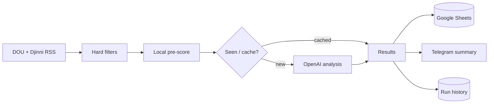

# Job Radar

**A scheduled job-search pipeline for developers who want relevant vacancies scored, deduplicated, logged to Google Sheets, and summarized in Telegram without automating applications.**

[Source](https://github.com/eerinessofsilence/jobs_radar) · [Setup & Operations](docs/setup-and-operations.md) · [Workflow](.github/workflows/job-radar.yml)



> **Status:** working personal automation with tests and a scheduled GitHub Actions workflow. It drafts replies but never applies to jobs.

## What it delivers

- Removes obvious non-fits before paid model analysis.
- Scores vacancies against a private, configurable search profile.
- Avoids repeated analysis with normalized-URL cache and seen lists.
- Appends structured fit, risks, salary, and draft-reply fields to Google Sheets.
- Sends a compact Telegram digest after each run.
- Records counts, skips, token use, estimated cost, warnings, and failures per run.

## Quick start

```bash
git clone https://github.com/eerinessofsilence/jobs_radar.git
cd jobs_radar
python3 -m venv .venv
source .venv/bin/activate
pip install -r requirements.txt
cp .env.example .env
python setup_profile.py
python job_radar.py
```

With Google Sheets, Telegram, and OpenAI credentials configured, the run should print a summary, update the configured spreadsheet, and send a Telegram message. Follow the [setup guide](docs/setup-and-operations.md) for exact headers, service-account access, secrets, scheduling, and troubleshooting.

## Tests, security, and limitations

```bash
pip install -r requirements-dev.txt
python -m poethepoet check
```

- Keep the personal profile, service-account JSON, bot token, and API key out of Git; use repository secrets in Actions.
- Generated replies require human review and are not submitted automatically.
- Feed availability, source markup, model output, and API quotas can affect coverage.
- Matching is decision support, not a guarantee that a vacancy is current, legitimate, or suitable.

## License

The repository is public for portfolio and evaluation purposes. No open-source license is currently included.
